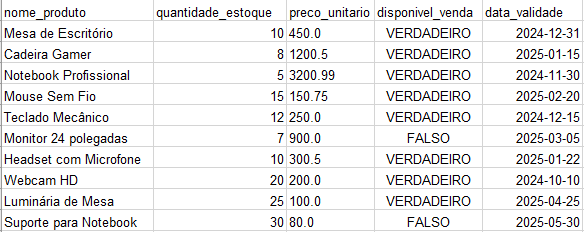

# O nosso desafio.... Validar dados do Excel?

### 📋 Pré-requisitos

### Vamos criar uma aplicação web para validar os dados do Excel utilizando o python.

#### Passo 1 - Você vai precisa ter o python instalando na marquina.
Selecione a versão mais estável clicando [aqui](https://www.python.org/ftp/python/3.12.3/python-3.12.3-amd64.exe).

para verificar a versão:

```
python --version
```

#### Passo 2 - Você vai precisa do vscode instalando na marquina.
Selecione a versão mais estável clicando [aqui](https://code.visualstudio.com/sha/download?build=stable&os=win32-x64-user).

#### Passo 3 - Vamos precisar criar um reposito no Github. Feito o processo de criação vamos criar uma pasta localmente para configurar nossa conta para sincroniza junto ao projeto.
clicando [aqui](https://github.com/).

#### Em desenvolvimento

#### Variáveis da panilha, String, Inteiro, Float, Booleano:

```
nome_produto: str = "Mesa de Escritório"
quantidade_estoque: int = 10 
preco_unitario: float = 450.0
disponivel_venda: bool = True
```



